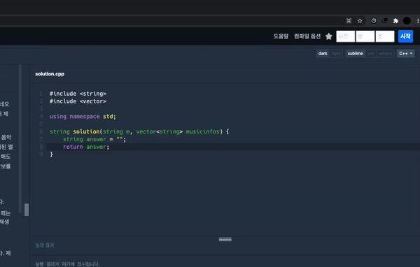
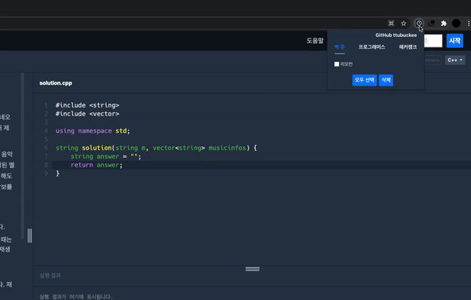
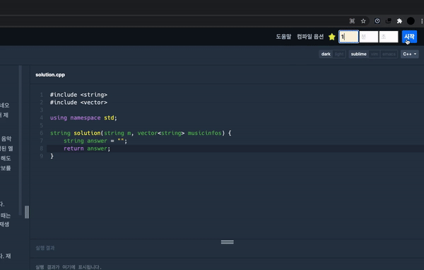
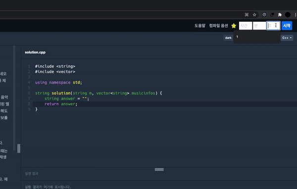

<h2 align="middle">⏱ CodapNote</h2>
<p align="middle">
  A Coding Test Timer Chrome Extension tool for Chrome Browser
</p>
<p align="middle">
  
  
  
  
</p>

## Installation
```shell
$ git clone https://github.com/ttubuckee/CodapNote_react  
$ cd CodapNote_react  
$ npm install  
$ npm run build  

 
Open Chrome Browser  
Go to chrome://extensions page  
Enable developer mode  
Click 'Load Unpacked'  
Select ./dist folder  
```

## Usage
 - 코답노트 확장앱 아이콘을 클릭해서 활성화 시켜줍니다.
 - 백준, 프로그래머스, 해커랭크 문제 풀이 페이지에 접속합니다.
 - 별 모양의 아이콘을 클릭하면 문제를 저장할 수 있습니다.
 - 코답노트 아이콘을 클릭하면 저장된 문제 목록을 조회/삭제 할 수 있습니다.
 - 각 저지 사이트에서 생성된 3개의 시간 입력 폼에 시간을 입력해서 타이머를 설정 할 수 있습니다.
 - 시간이 완료되면 알림창이 열립니다.

[크롬 웹스토어 바로가기](https://chrome.google.com/webstore/detail/%EC%BD%94%EB%8B%B5%EB%85%B8%ED%8A%B8-%ED%94%84%EB%A1%9C%EA%B7%B8%EB%9E%98%EB%A8%B8%EC%8A%A4%EB%B0%B1%EC%A4%80%ED%95%B4%EC%BB%A4%EB%9E%AD%ED%81%AC-%EB%AC%B8%EC%A0%9C%ED%92%80%EC%9D%B4-%ED%99%95%EC%9E%A5/jnblbdlgdgbbgpnllacdodkncdckndli?hl=ko)
